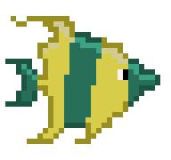

<h1 align="center">Moon-Pi</h1>

  Welcome to my personal website! My name is Ryan, and this is where my personal projects reside. 

   
   
  <a href="https://www.moon-pi.net/">Portfolio</a>
  ·
  <a href="https://www.linkedin.com/in/ryan-tombleson-6499ba231/">LinkedIn</a>

   
   
   
   

<h2 align="center"> Red Book</h2>

  

    This project aims to create a solution for saving the price of each scroll in the MMORPG Maplestory. Prices are volatile and change frequently, and the going rate for any given item may change based on time, availability, or marketing trends. Using this solution, users will be able to find the price of an item, even if the item is unavailable due to popularity or scarcity. This is a portfolio site, so it includes my personal portfolio and will soon include a second project.
     
     
    <a href="https://www.moon-pi.net/RedBook">Demo</a>
    ·
    <a href="https://github.com/RyanAtRowan/MoonPi_UnPublished/issues/new?labels=bug&template=bug-report---.md">Report Bug</a>
    ·
    <a href="https://github.com/RyanAtRowan/MoonPi_UnPublished/issues/new?labels=enhancement&template=feature-request---.md">Request Feature</a>
  

   
   
   
   

  
  <h2 align="center"> Hook or Be Hooked</h2> 
    

      Hook or Be Hooked is a real-time, multiplayer arcade game designed for web browsers, using the power of modern web technologies to create a seamless and interactive experience.  The game immerses the players in a dynamic battle between two distinct roles: the Fish and the Hook, with additional involvement from Spectators who can influence the game directly by throwing obstacles into the playfield.
     
     
    <a href="https://www.moon-pi.net/HookOrbehooked">Demo</a>
    .
    <a href="https://github.com/RyanAtRowan/MoonPi_UnPublished/issues/new?labels=bug&template=bug-report---.md">Report Bug</a>
    .
    <a href="https://github.com/RyanAtRowan/MoonPi_UnPublished/issues/new?labels=enhancement&template=feature-request---.md">Request Feature</a>
    

    

